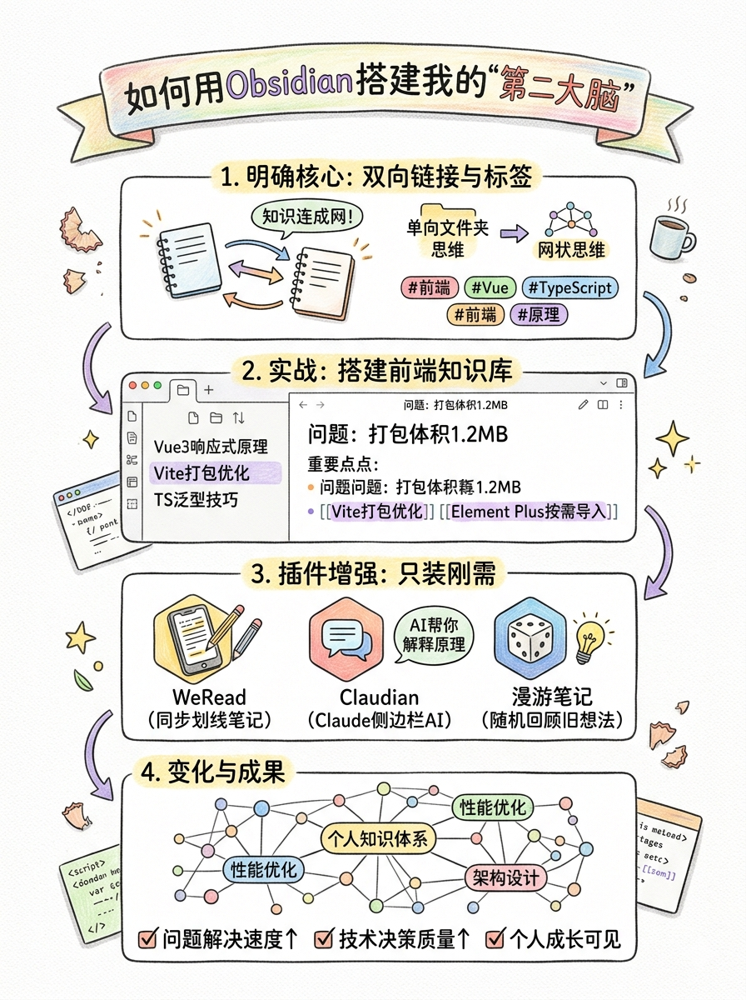

最近团队里，闪电（全栈工程师） 经常在工位上说这个词：Obsidian。

"我在B站看了个教程，用Obsidian搭了个'第二大脑'！"他兴奋地给我（清风，前端工程师）展示屏幕，"你看，这是知识图谱，所有前端技术都连在一起了！"

屏幕上，密密麻麻的节点和连线，像一张巨大的蜘蛛网。"Vue3"连着"Composition API"，"TypeScript"连着"泛型"，"Vite"连着"插件系统"……

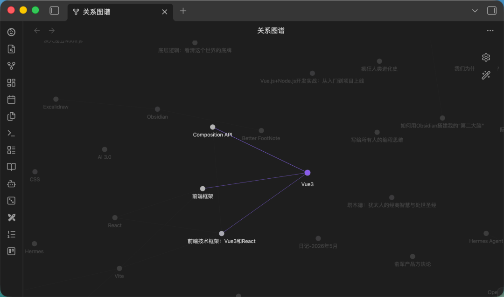

我看着有点发怵。"这又是什么新工具？现在AI工具一天出一个，我连Claude Code都还没用熟呢。"

旁边的**云流**（全栈组长） 听到了我们的对话，走过来："清风，你不要有压力。工具是为人服务的，不是用来增加负担的。Obsidian到底适不适合你，我帮你分析分析。"

## 一、Obsidian到底是什么？换个角度看笔记

"一句话：Obsidian是个本地笔记软件，核心是**双向链接**，能把知识连成网。"云流说。

但我还是困惑："双向链接？什么意思？我们现在用的飞书文档、Confluence，不也是链接吗？"

"完全不一样。"云流打开飞书，点进一个Vue3组件文档，"你看，这是典型的文件夹思维：文档A、文档B，放在文件夹'前端'里。它们之间是孤立的。"

"但现实中，"他继续，"知识是有联系的。你解决一个Vue3内存泄漏问题，可能涉及到TypeScript的类型系统、Vite的构建配置、浏览器的事件循环原理。这些知识是网状的，不是树状的。"

"Obsidian的双向链接，就是让你在笔记之间建立这种网状连接。"

## 二、为什么突然这么火？AI时代的"知识焦虑"

我问："那为什么现在突然火了？之前没听说过啊。"

"两个原因。"云流分析，"第一，AI爆发了。以前我们比拼'谁知道得多'，现在AI知道的比我们多。我们的竞争力变成了'谁有自己的思考体系'。Obsidian恰好帮你沉淀思考、建立体系。"

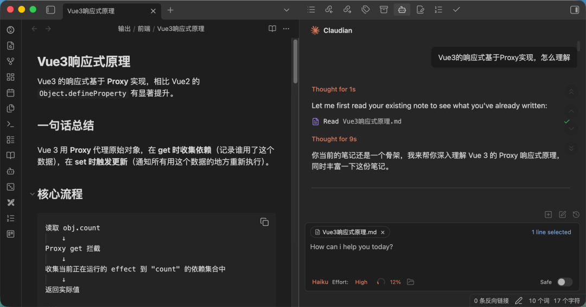

"第二，"他看向闪电，"像闪电这样的技术狂热者，需要管理海量的技术文档、文章、代码片段。传统笔记放进去就'死'了，Obsidian能让知识'活'起来。"

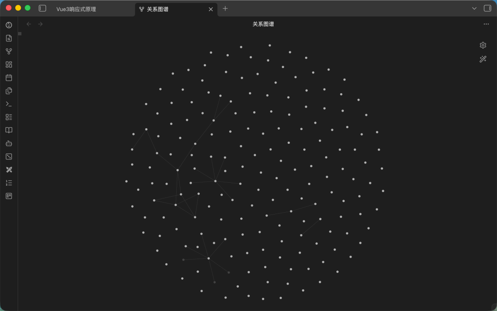

闪电点头："对！比如我上周解决一个Webpack打包问题，用Obsidian记下来。今天遇到类似的Vite问题，一点链接，上周的解决方案就出来了。知识活了！"

## 三、我到底需不需要？普通前端工程师的自我评估

"那我需要学吗？"我问，"感觉好复杂。"

"问自己几个问题："云流说，

```text
✅ 你是不是经常看技术文章，但看完就忘？
✅ 你是不是遇到过类似bug，但想不起上次怎么解决的？
✅ 你是不是在做技术选型时，想不起各种方案的优缺点？
✅ 你是不是想把AI的答案沉淀下来，而不是每次重新问？
```

如果'是'，那可以考虑。"

"但如果你只是临时记个TODO，或者需要团队协作编辑，"他补充，"那用飞书就够了。Obsidian是思考工具，不是协作工具。"

我仔细想想：上周看了一篇Vue3响应式优化的文章，觉得很好，但现在想不起细节。上个月解决了一个TypeScript泛型报错，今天又遇到了类似问题，但排查步骤忘了。

"好像……挺需要的。"我说。

## 四、它能帮我做什么？前端开发的实际场景

"说几个你肯定遇到的场景。"云流举例。

### 4.1 场景：技术问题排查记录

"你上周解决了'某教育'后台的打包体积问题，用Obsidian记下来。下次再遇到，搜'打包优化'，不仅能找到记录，还能看到相关的Vite配置、Webpack对比、性能监控方法——因为它们都通过双向链接连在一起了。"

### 4.2 场景：技术选型参考

"三个月前，团队在Vue3和React之间做选择。用Obsidian记下各自的优缺点、适用场景、团队技术栈匹配度。下次新项目选型，直接看笔记，不用重新调研。"

### 4.3 场景：个人技术成长

"你把学到的TypeScript高级类型、Vue3组合式API、性能优化技巧，都用Obsidian记下来。时间长了，你就有了自己的前端知识体系，而不是零散的知识点。"

### 4.4 场景：AI辅助开发

"你让Claude帮你写个组件，把对话记录保存到Obsidian。下次写类似组件，先看历史记录，让AI基于你的最佳实践继续改进。"

## 五、实战：从零开始搭建我的前端知识库

"现在，我带你实际操作。"云流说。

### 5.1 安装，但别掉进"装修陷阱"

"下载Obsidian，打开。你会看到一个很简洁的界面。"

"但注意，"他警告，"很多人掉进'装修陷阱'：折腾主题、字体、插件，几周后笔记数量：0。然后卸载。"

"我们不走这条路。第一阶段，只用默认功能。"

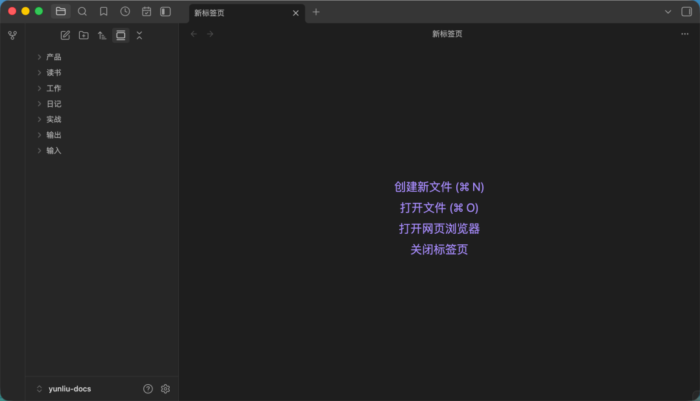

### 5.2 认识界面，聚焦核心

界面三分栏：

```test
左侧：文件列表（可隐藏）  
中间：笔记编辑区
右侧：关系图谱（先关掉）
```

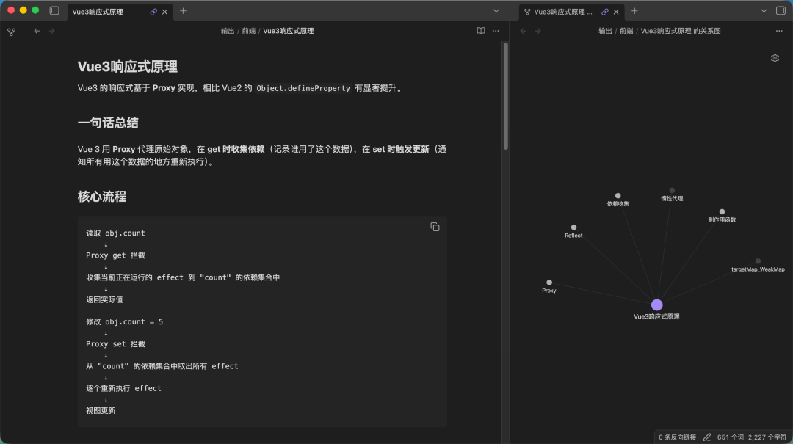

"新手只要记住两个入口：左下角设置（小齿轮），和命令面板（Ctrl+P）。"

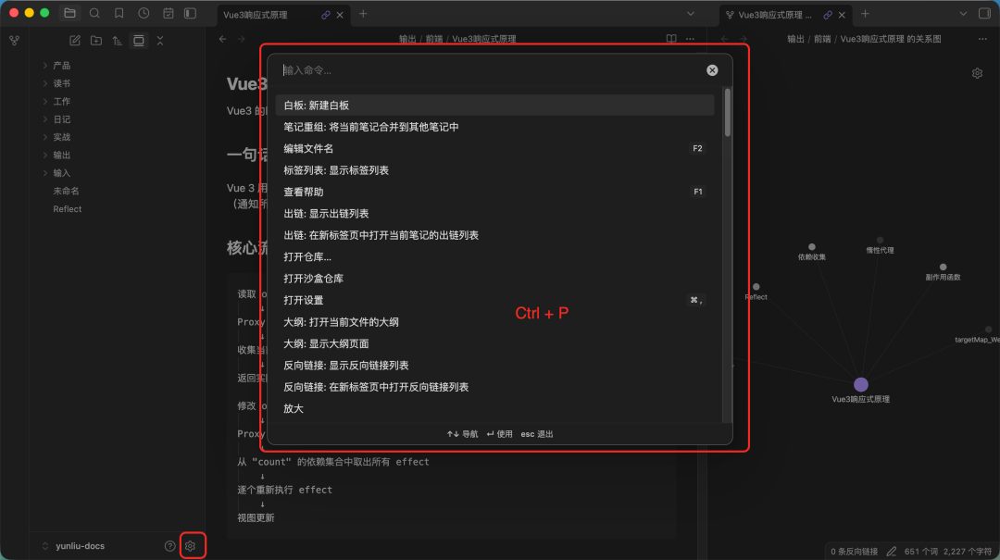
### 5.3 核心功能1：双链，让知识"活"起来

"现在，创建第一篇笔记：'Vue3响应式原理'。"

我在中间输入：

```
Vue3的响应式基于Proxy实现，相比Vue2的Object.defineProperty有显著提升。

相关概念：
- [[Proxy]] 
- [[依赖收集]]
- [[副作用函数]]
```

"看，`[[Proxy]]`变成了紫色链接。点它，就创建了新笔记'Proxy'。在'Proxy'笔记里，自动有反向链接显示哪些笔记链接了它。"

"这就是双向链接：A链接到B，B自动知道A链接了它。知识不再是单向的，而是网状的。"

闪电补充："比如你在'Vue3'笔记里链接了'TypeScript'，在'TypeScript'笔记里，你会看到'反向链接：Vue3'。下次在'TypeScript'笔记里，就知道这个知识点在Vue3里用到了。"

### 5.4 ：核心功能2：标签，多维分类

"双链建立连接，标签提供分类。在笔记末尾加标签："

```
---
tags: 
  - 前端
  - Vue
  - 原理
---
```

"标签可以层级化：`#前端/Vue`。但建议不超过3级。"

"文件夹+标签的组合：文件夹做粗分类（前端、后端、数据库），标签做细检索（Vue、TypeScript、性能优化）。"

### 5.5 我的第一天实践

"今天就开始：把你最近解决的三个前端问题，用Obsidian记下来。"

我记录的第一个问题："某教育后台打包体积优化"。

```
# 问题：vendor.js体积1.2MB，首屏加载慢

## 分析
使用`vite-plugin-visualizer`分析，发现：
1. Element Plus全量导入，占40%
2. 某个图表库重复打包
3. 未使用的CSS未摇树

## 解决方案
1. 使用`unplugin-vue-components`按需导入Element Plus
2. 配置`vite-plugin-chunk-split`代码分割
3. 开启CSS摇树优化

## 效果
- 体积：1.2MB → 680KB
- 首屏加载：2.8s → 1.6s
- LCP：3.1s → 1.9s

## 相关链接
- [[性能优化]]
- [[Vite打包优化]]
- [[Element Plus按需导入]]

## 标签
- 前端
- 性能优化
- Vite
- 实战案例
```

写完，我发现：知识被结构化、连接化了。下次再遇到打包问题，我不仅能找到这篇笔记，还能通过链接找到所有相关主题。

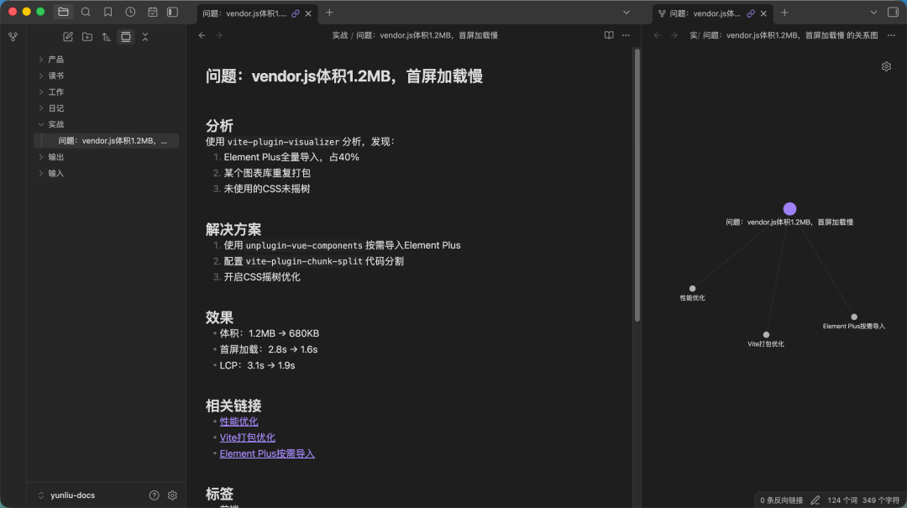

## 六、插件：只装真正需要的

一周后，我基本熟悉了双链和标签。云流说："现在可以考虑插件了。但原则是：只装刚需。"

### 6.1 插件：[[WeRead]]（微信读书同步）

"我经常在微信读书看技术书籍，"我说，"但划线笔记散落在各个书里。"

"装WeRead插件，扫码登录微信读书，设置同步。"云流指导。

设置后，我在《Vue.js设计与实现》里的所有划线，自动同步到Obsidian，按书籍分类。

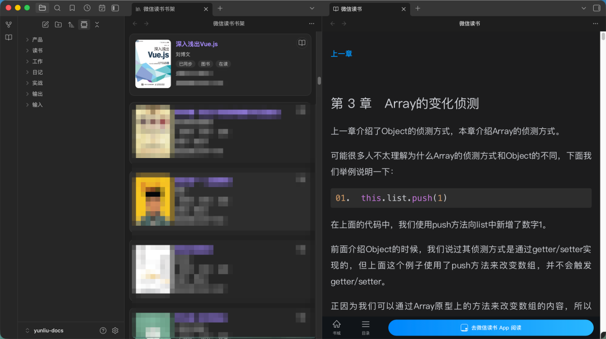

### 6.2 插件：Claudian

"我经常要在看笔记时问AI问题，"我说，"每次都要切换到浏览器。"

"装Claudian插件，Claude就在侧边栏了。"

配置后，Obsidian右侧出现了Claude Web界面。我选中一段关于"Vue3响应式原理"的笔记，复制到Claude："用通俗的话解释这段原理。"Claude的回答，我直接保存为新笔记。

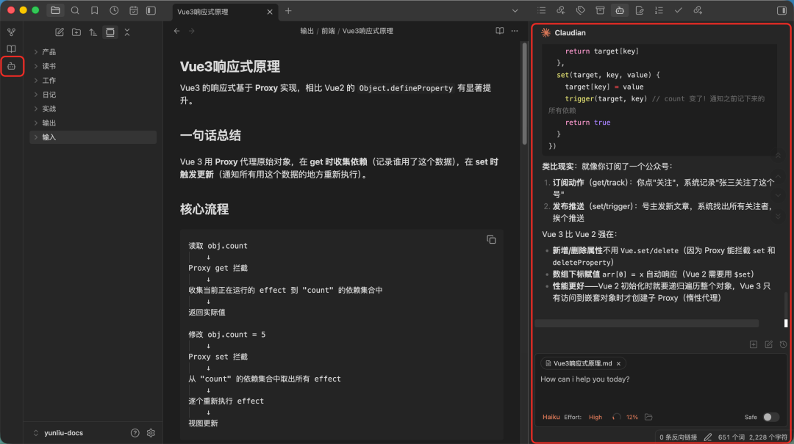

### 6.3 插件：漫游笔记（随机回顾）

"装了这个，每次点击随机打开一篇旧笔记。"云流说，"你会发现很多被遗忘的宝藏想法。"

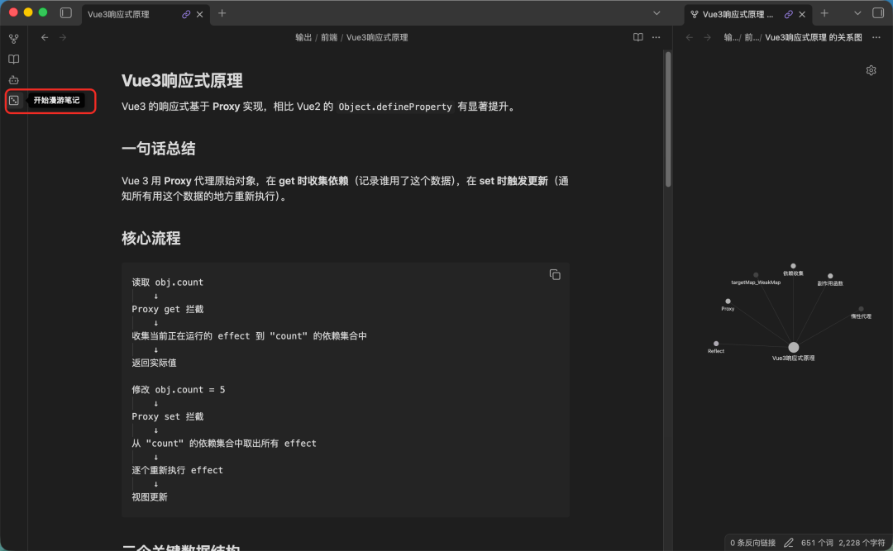

我点了三次：

```text
1. 打开了两个月前记录的"TypeScript泛型技巧" 
2. 打开了一篇关于"前端监控体系搭建"的文章总结
3. 打开了上周记录的"团队代码规范讨论"
```

那些被遗忘的知识，重新被激活了。

## 七、我的完整工作流

一个月后，我的工作流稳定了：

### 7.1 早晨：阅读沉淀

```text
1. 微信读书看技术文章→划线自动同步到Obsidian
2. 浏览GitHub Trending→发现好项目，摘要保存到Obsidian
3. 阅读团队技术分享→总结要点，链接到已有知识
```

### 7.2 开发中：问题记录

```text
1. 遇到bug→记录现象、分析过程、解决方案
2. 代码审查→记录优秀代码模式、常见问题
3. 技术讨论→记录各方观点、最终决策、原因
```

###  7.3 下班前：整理连接

```text
1. 为新笔记添加双链，连接到相关主题
2. 打标签，分类归档
3. 用"漫游笔记"随机回顾，激发新思考
```

## 八、看得见的变化

三个月后，我的Obsidian知识库：

```text
笔记数量：270篇
    
- 双链连接：952个
    
- 标签：前端、Vue、React、TypeScript、性能优化、工程化、架构设计……
```

更重要的是，变化是实质的：

###  8.1 变化：问题解决速度

以前遇到TypeScript泛型报错，要搜半小时。现在搜"泛型"，找到历史记录，5分钟解决。

### 8.2 变化：技术决策质量

新项目选状态管理库，打开"状态管理对比"笔记，Pinia、Vuex、Zustand的优缺点、适用场景、团队熟悉度一目了然。

### 8.3 变化：个人成长可见

打开关系图谱，看到自己的知识网络：从零散的"Vue组件"、"CSS技巧"，到系统的"前端工程化"、"架构设计"。成长路径清晰可见。

### 8.4：团队协作提升

虽然Obsidian是个人工具，但我把精华笔记分享到团队。**闪电**看后说："**清风**，你这个Vite优化总结太有用了！我加到团队文档里。"

## 九、给同样迷茫的前端伙伴

现在，团队里有新人问我："**清风**哥，我要不要学Obsidian？感觉好复杂。"

我会说："先问自己：你的知识是不是'死的'？是不是看过就忘？解决过的问题是不是又踩坑？"

"如果是，试试Obsidian。但记住："

```text
1. 从简单开始：只用双链和标签，别折腾插件
2. 从实用开始：记录真实问题和解决方案，别写'完美笔记'
3. 从连接开始：每篇新笔记，想想和什么有关，加上链接
4. 从坚持开始：每天记一点，三个月后回头看"
```

最好的工具，不是功能最多的，而是让你忘记工具本身，专注思考的。Obsidian对我来说，就是这样一个工具。

它没有让我的工作更复杂，而是让我的思考更清晰，让我的成长有迹可循。

在AI时代，当信息获取越来越容易，真正的竞争力，或许是那些被深刻思考、有机连接、持续沉淀的，属于自己的知识体系。

（**清风**，于一次团队内部分享会。）