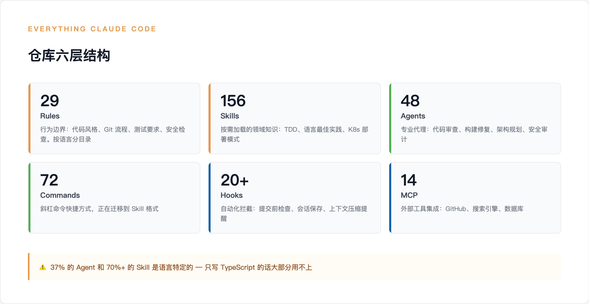
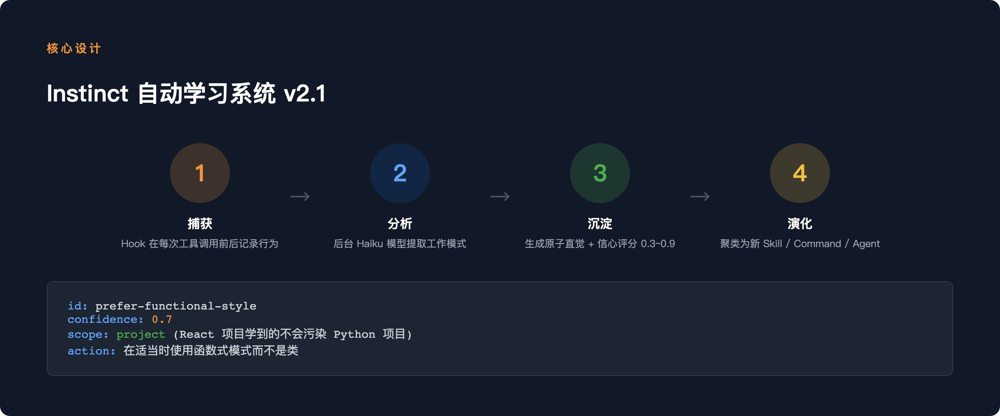
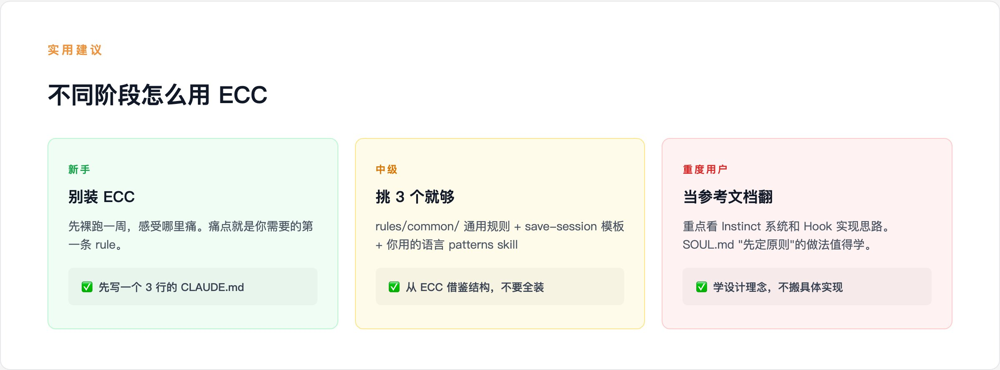

> 原文地址：[https://x.com/runes_leo/status/2041881010200039737?s=46](https://x.com/runes_leo/status/2041881010200039737?s=46)

[GitHub](https://github.com/) 上有个叫 [Everything Claude Code](https://github.com/affaan-m/everything-claude-code) 的仓库，136K 星，20K fork。号称最完整的 Claude Code 配置集合——156 个 skill，48 个 agent，72 个 command，20 多个自动化 hook。

中文圈已经有好几篇介绍它的文章，甚至有人把整个仓库翻译成了中文。但翻了一圈，没找到一篇是真的装了、用了、然后告诉你"值不值得"的。

我自己磨了三个月的 Claude Code 体系（61 个 skill，15 个 agent，每天在用），花了一下午把这个仓库拆了一遍。这篇写两件事：它到底装了什么，以及哪些真的有用。

## 仓库全景

先看它的骨架。整个仓库分六层：

- **Rules**（29 条，按语言分）— 行为边界：代码风格、Git 流程、测试要求、安全检查
- **Skills**（156 个）— 按需加载的领域知识：TDD、Python 最佳实践、K8s 部署模式
- **Agents**（48 个）— 专业代理：代码审查、构建错误修复、架构规划、安全审计
- **Commands**（72 个）— 斜杠命令快捷方式（正在迁移到 skill）
- **Hooks**（20+ 个脚本）— 自动化拦截：提交前质量检查、会话结束保存、上下文压缩提醒
- **MCP**（14 个配置）— 外部工具集成：GitHub、搜索、数据库

看数字很唬人。但仔细看内容，会发现一个特点：它是按编程语言铺开的。

48 个 agent 里，10 个是语言特定的代码审查器（TypeScript、Python、Go、Java、Kotlin、C++、C#、Flutter、Rust、Swift 各一个），8 个是对应的构建错误修复器。这 18 个 agent 占了总数的 37%。

156 个 skill 更明显：Python patterns、Go patterns、Kotlin patterns、Java patterns、Swift patterns、Laravel patterns、Django patterns……每种语言/框架一套测试 + 最佳实践 + 编码规范，排列组合一下就到了 156。

这不是说质量不行。每个 skill 都是认真写的，Django TDD 的 skill 确实教你怎么做测试驱动开发。但如果你只写 TypeScript，那 70% 的 skill 跟你没关系。

## 五个值得细看的设计

拆完整个仓库，我觉得真正有意思的是这五个东西。

### 1. SOUL.md — 五条核心原则

大多数 Claude Code 配置上来就是规则列表。ECC 先定了五条原则：

- Agent-First — 能交给专业 agent 的不自己做
- Test-Driven — 改代码前先写测试
- Security-First — 验证输入、保护密钥、安全默认
- Immutability — 优先显式状态转换，不搞隐式变异
- Plan Before Execute — 复杂改动先分解再动手

这五条不是装饰。所有 agent 和 skill 的设计都在遵守这套原则。比如 planner agent 用的是 Opus 模型（最贵最强），因为规划是最关键的环节；code-reviewer 用 Sonnet，因为审查是高频操作，要平衡成本。模型选择跟原则对齐。

我自己的体系没有显式的"原则层"，只有 rules。看完 `SOUL.md` 之后觉得，先定原则再写规则，确实让整套系统更有一致性。这个值得学。

### 2. Instinct 学习系统（v2.1）

这是 ECC 最有野心的设计。

普通的配置是静态的——你写好规则，Claude 遵守。ECC 的 Instinct 系统试图让 Claude 自己学：

- Hook 在每次工具调用前后捕获行为
- 后台用 Haiku（便宜模型）分析你的工作模式
- 生成"原子直觉"——带信心评分（0.3 到 0.9）的行为判断
- 积累够多之后，自动聚类为新的 skill

举个例子：如果你连续 5 次把基于 class 的代码改成函数式写法，系统会生成一条 `instinct：prefer-functional-style`，信心 0.7，作用域限定在当前项目。下次写代码它会自动偏向函数式风格

v2.1 加了项目隔离——React 项目学到的模式不会污染 Python 项目。还支持导入导出，意味着你能把自己的 instinct 分享给别人。

想法很好。但说实话，我对效果持保留态度。用 Haiku 后台分析意味着每次工具调用都有额外开销，而且"信心 0.7"这种数字到底准不准，没看到过验证数据。我自己的 `patterns.md` 是手动触发写入的——只在被纠正时记录，质量更可控，428 条经验没有一条是自动生成的。

自动化学习 vs 手动沉淀，两条路，各有取舍。Instinct 覆盖面广但噪声可能高，手动记录精确但依赖"被纠正"这个触发条件，没被纠正的经验就漏了。

### 3. Hook 自动化体系

ECC 的 hook 覆盖了 8 种事件类型，20 多个脚本。几个我觉得特别值得关注的：

- `block-no-verify.js` — 拦截 git commit --no-verify。很多人（包括 AI）偷懒跳过 `pre-commit hook`，这个直接在 Claude 层面堵死。简单但有效。
- `suggest-compact.js` — 计数工具调用次数，到 50 次自动建议 `/compact` 压缩上下文。这比在 rules 里写"超过 50 次提醒"靠谱——hook 是程序级保证，rules 是 AI 级遵守，后者会忘。
- `evaluate-session.js` — 会话结束时自动提取工作模式，喂给 Instinct 系统。上面说的自动学习，靠的就是这个 hook 收尾。
- `pre-bash-commit-quality.js` — 提交前自动跑 lint 和密钥检测。

还有个细节：hook 支持三级严格等级（`minimal / standard / strict`），可以按需调。不想被太多 hook 烦到可以开 minimal，强迫症可以开 strict。

### 4. 选择性安装架构

这个解决了一个真实痛点：156 个 skill 你不可能全装。

ECC 搞了一套 manifest 驱动的安装系统。`install-modules.json` 把所有组件分成模块，每个模块标注了成本（`light / medium / heavy`）、稳定性（`stable / beta`）、和目标平台。你可以只装 rules-core + hooks-runtime，跳过所有语言特定的 skill。

这个设计思路比"clone 整个仓库然后自己删"文明多了。

### 5. 多平台兼容

ECC 不只是给 Claude Code 用的。它同时支持 Cursor、Codex、OpenCode、Antigravity。同一套 agent 定义，根据不同平台的能力做适配——Claude Code 能用全部 48 个 agent，OpenCode 只用 12 个。
如果你在多个 AI 编码工具之间切换，这套统一配置省得每个工具重配一遍。

## 三个没人提的问题

拆完仓库，有几个事我觉得值得说但没看到别人讨论。

### 过度工程化的代价

156 个 skill、48 个 agent、72 个 command——维护这些东西本身就是一个项目。ECC 的 `CONTRIBUTING.md` 有 100 多节，光看贡献指南就要半天。

对个人用户来说，全装 ECC 意味着你的 `.claude/` 目录里突然多了几百个你不了解的文件。某个 hook 报错了，你知道去哪里查吗？某个 agent 给了奇怪的建议，你能判断是 agent 的问题还是你的代码有问题吗？

你装了一套你不了解的系统，出了问题反而比没装更难排查。

### Hook 执行任意脚本的安全面

ECC 的 hook 本质是在工具调用前后执行 Node.js 脚本。这意味着你装 ECC 的时候，等于授权了 20 多个脚本在你的机器上跑。

大部分脚本做的是无害的事（计数、提醒、保存）。但这个机制本身是有攻击面的——如果有人往 fork 版里塞了恶意脚本，或者依赖链被注入，后果不只是配置出问题，是代码和密钥可能泄露。

装之前建议至少扫一遍 `scripts/hooks/` 目录。这不是 ECC 特有的问题，所有基于 hook 的 Claude Code 配置都有这个风险。

### 跟 Claude Code 原生能力的重叠

Claude Code 自己在快速迭代。原生 subagent 已经上线，原生 memory 和 skills 也在完善。ECC 的很多功能（session 保存、agent 路由、skill 定义）在 Claude Code 早期确实是必要的补充，但官方功能追上来之后，有些模块可能变成冗余。

比如 ECC 的 72 个 command 已经在迁移到 skill 格式，因为 Claude Code 原生 skill 系统比自定义 command 更好用。这种"被官方追上"的情况以后只会更多。

选择 ECC 的时候要想清楚：你是在用一个活跃维护的框架（最新版 v1.9.0，还在更新），还是在给自己加一层迟早要拆的中间件？

### 拆完我改了什么

说几个实际的。

`session-end` 加了失败路径。 ECC 的 `save-session` 模板有个字段叫 "What Did NOT Work"。我之前只记做了什么，没记"什么方案试了但失败了"。看完当天就加了。这个改动很小，但对下次遇到类似问题时的决策很有帮助。

确认了 `patterns.md` 的项目隔离已经到位。 ECC 的 Instinct v2.1 强调项目隔离防止污染。对照了一下，我的 `patterns.md` 按主题分 10 个文件（`workflow/data/debugging/content` 等），天然隔离。但看到 Instinct 的做法后，考虑后续加按项目维度的索引。

Hook compact 提醒暂时没做。 `suggest-compact.js` 确实比 rules 里写规则靠谱。但我评估了一下，当前 rules 里的提醒已经够用，花时间搞 hook 的 ROI 不够。等哪天 rules 提醒确实失效了再说。

## 建议

刚开始用 Claude Code：不要装 ECC。先裸跑，感受痛点。痛点就是你需要的第一条 rule。

有了自己的 `CLAUDE.md`，想参考别人的配置：从 ECC 挑三个东西就够了——`rules/common/` 里的通用规则看一遍，`save-session` 的模板借鉴一下结构，你用的语言对应的 patterns skill 装一个试试。

重度用户，已经有自己的体系：把 ECC 当参考文档翻，重点看 Instinct 系统和 Hook 实现的思路。具体实现未必要搬过来，但设计理念值得消化。特别是 `SOUL.md` 那种"先定原则"的做法。

所有人：装之前扫一遍 `scripts/hooks/`。20 多个脚本在你机器上跑，花 10 分钟看一眼不亏。

136K 星说明很多人在摸索怎么把 AI 编码工具用好。ECC 给了一个不错的参考，挑走你需要的部分就行。全装大概率用不上，挑着装大概率有收获。