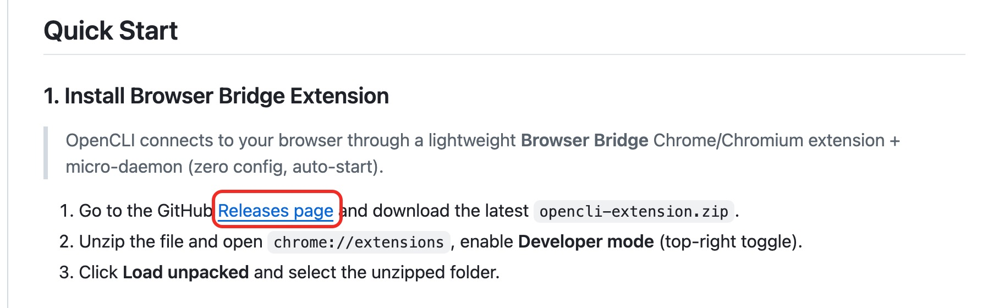
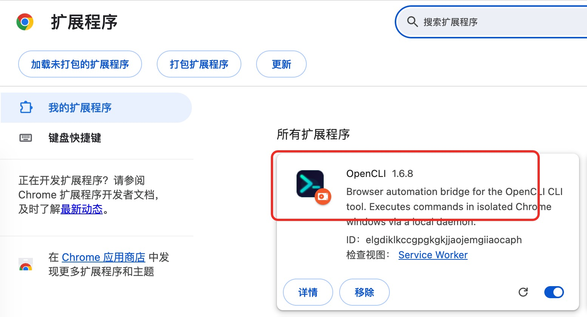
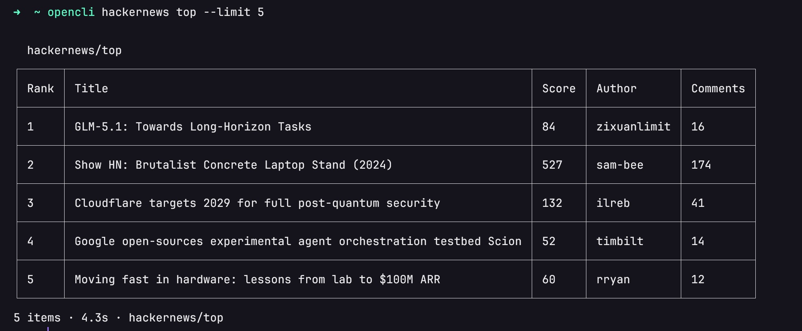
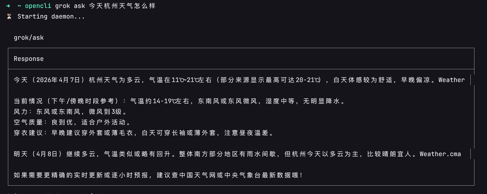

## 1. 安装插件

1. 进入 [OpenCLI Github](https://github.com/jackwener/opencli)。

1. 找到 [Relase Pages](https://github.com/jackwener/opencli/releases) 点击进入



1. 下载最新的 `opencli-extension.zip`。

1. Chrome 浏览器，输入 `chrome://extensions/`，右上角的【开发者模式】开启，将刚才下载的 `opencli-extension.zip` 拖拽到扩展程序页面中。



## 2. 安装 CLI

```bash
npm install -g @jackwener/opencli
```

## 3. 验证

查询 hackernews 上前 5 个热门话题：

```bash
opencli hackernews top --limit 5
```



查询天气：

```bash
opencli grok ask 今天杭州天气怎么样
```


