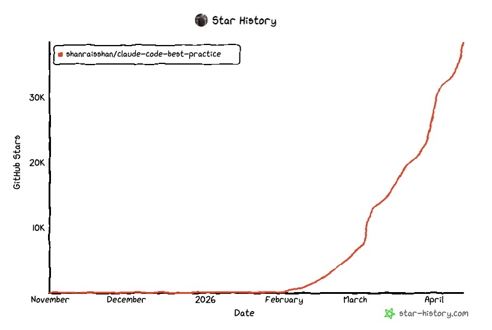

Star History，星标历史，是一个记录 Github 仓库 Star 历史变化的工具。

## 这个图是做什么的

- **数据可视化： 它将 **GitHub 仓库的静态 Star 数字转化成动态的时间曲线。
- **项目走势分析： 图中横轴是时间（Date），纵轴是 Star 数量（GitHub Stars）。

以 [claude-code-best-practice](https://github.com/shanraisshan/claude-code-best-practice) 为例，可以看到该项目在 2026 年 2 月之前几乎没有关注度，但从 3 月开始突然爆发式增长，到 4 月已经接近 4 万 Stars。

## 这个图有什么用？

对于开发者、投资者或开源爱好者来说，它有以下几个核心用途：

- **衡量流行度**： 快速判断一个项目是“陈年老坑”还是正在崛起的“超新星”。
- **识别增长点**： 陡峭的曲线通常意味着该项目在特定时间点（如发布了重大更新、在社交媒体走红或被技术大佬推荐）获得了大量关注。
- **辅助决策**： 帮助开发者决定是否要学习或使用某个库。如果一个项目的 Star 数持续下滑或停滞，可能意味着它已不再维护。
- **竞品对比**： 许多工具支持在同一张图上对比多个项目，一眼就能看出谁的市场占有率增长更快。

## 如何生成这种图？

这张图是由专门的在线工具 Star History 生成的，其标志就在图片右下角。你可以按照以下步骤制作：

- 访问网站： 打开 star-history.com。
- 输入仓库名： 在搜索框中输入你感兴趣的 GitHub 仓库完整路径（例如 shanraisshan/claude-code-best-practice）。
- 生成图表： 点击 "View Star History"，网站会自动调用 GitHub API 渲染出曲线。
- 自定义：
  - 你可以点击 "Add a repository" 同时对比多个项目。
  - 你可以选择不同的显示模式（如“手绘风”或“经典风”）。
