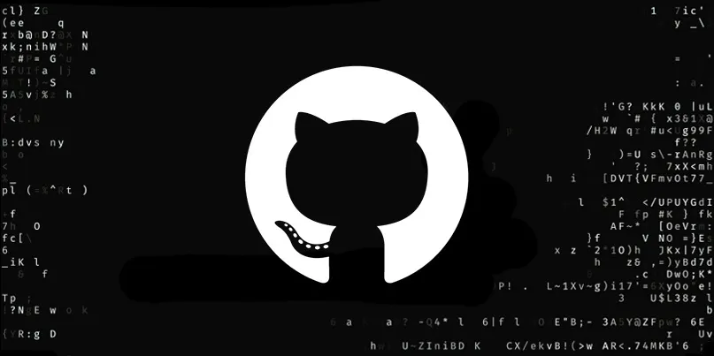

Github 是世界上最大的代码托管平台，也是最大的开源社区。

## 扮演角色

Github 是一个远程仓库，可以理解为“代码界的百度网盘” + “程序员的微博”。

核心功能：

- **存储**：把你的前端、后端、AI 代码备份到云端，换台电脑也能下载。
- **展示**：别人可以访问你的主页，看到你的项目和技术能力（程序员的简历）。
- **协作**：支持多人共同开发一个项目，通过 Pull Request（PR）来合并代码。
- **生态**：提供自动化工具（GitHub Actions）、静态网页托管（GitHub Pages）等。
