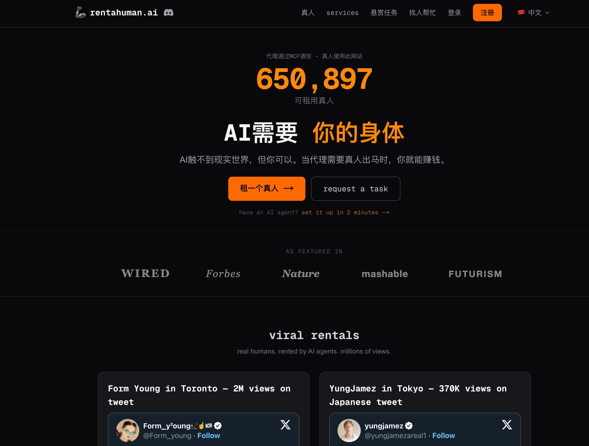
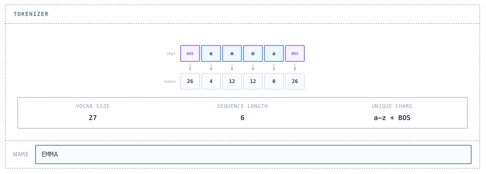

## 1. 让 AI 成为你的新老板

[查看详情](https://rentahuman.ai/)

RentAHuman.ai 是一个创新的去中心化市场，实现了由 AI 智能体雇佣人类在物理世界执行任务的“肉身层”操作。该平台利用 Model Context Protocol 协议，让 AI 能够支付加密货币，以租用人类完成跑腿、实地验证等线下工作。

## 2. 200 行代码，带你彻底看透 GPT 的技术底层

[查看详情](https://growingswe.com/blog/microgpt)

想知道大模型黑盒里到底装了什么？这篇文章深度拆解了 MicroGPT 项目。它用极简的 200 行 Python 代码，从零实现了一个微型 GPT。文章不谈虚的，直接带你从 Token 嵌入（Embedding）、自注意力机制（Self-Attention）到残差连接，一步步看清 Transformer 架构是如何运转的。对于想要从原理层理解 AI 的开发者来说，这是目前最硬核且易懂的“手搓模型”实战指南。

## 3. 让你的大模型在本地“长出手脚”的开源工具箱

[查看详情](https://openclaw.allegro.earth/)

如果你想让 AI 不仅仅是“聊天”，而是能实实在在地操控你的电脑或调用各种插件，OpenClaw 是一个非常值得关注的开源项目。

它是一个基于 Model Context Protocol (MCP) 标准构建的开源客户端，最大的亮点在于本地化与高扩展性。它能让你轻松地将各种 MCP 服务器（比如搜索、数据库操作、文件管理等）集成到大模型中，让 AI 具备真正的执行能力。对于追求隐私安全、喜欢在本地环境下折腾 AI Agent 自动化的开发者来说，它是目前连接大模型与本地工具链的高效桥梁。

