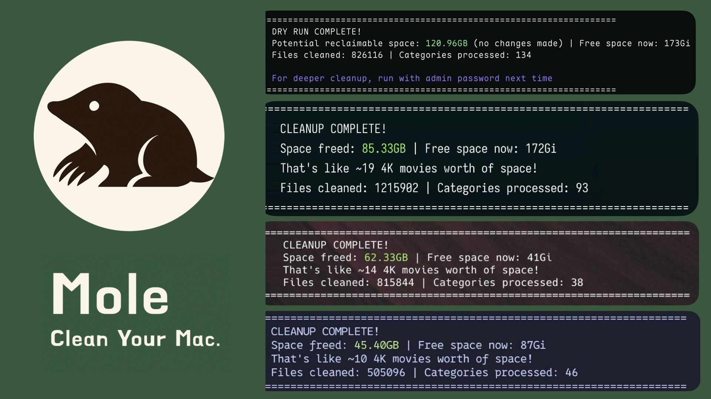
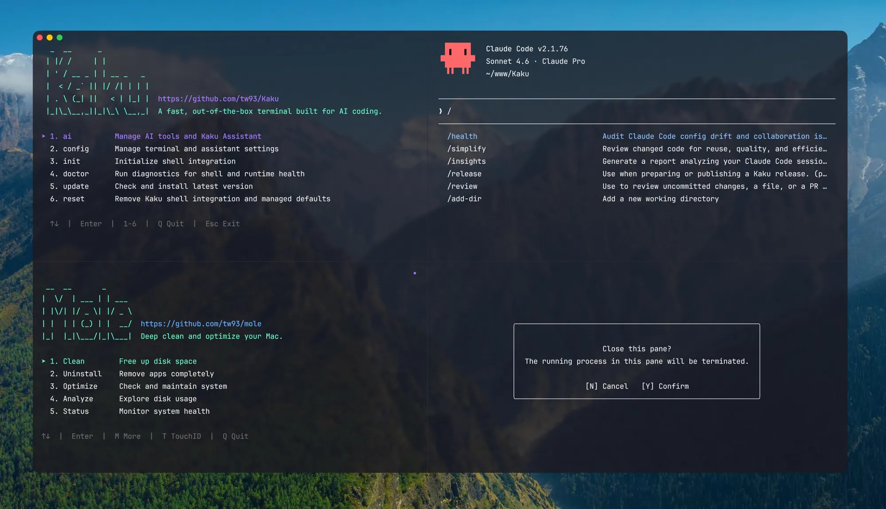

> “遇事不决，可问春风。” &nbsp;&nbsp;&nbsp;&nbsp;—— 齐静春 /《剑来》

## 1. Claude Code：架构、治理与工程实践

[查看详情](https://tw93.fun/2026-03-12/claude.html)

围绕上下文管理、Skills、Hooks、Subagents、Prompt Caching 以及 CLAUDE.md 的设计展开，重点讨论怎样让协作过程更稳定、更可控，偏工程师技术视角的最佳实践，欢迎大伙一起最佳交流。

## 2. 你不知道的 Agent：原理、架构与工程实践

[查看详情](https://tw93.fun/2026-03-21/agent.html)

在写完[「你不知道的 Claude Code：架构、治理与工程实践」](https://tw93.fun/2026-03-12/claude.html)之后，发现自己对 Agent 底层的理解还不够深入，加上团队在 Agent 方向已经有不少业务落地经验，一直缺少一份系统梳理，所以我又把资料、开源实现和自己写的代码一起过了一遍，最后整理成了这篇文章。

## 3. Mole 发布了 1.31 版本了

[查看详情](https://github.com/tw93/Mole/releases/tag/V1.31.0)

Mole 是一个专为 macOS 设计的开源命令行系统清理与优化工具，致力于成为 CleanMyMac 等付费软件的免费轻量级替代品。它提供深度清理、智能卸载、磁盘分析和项目清理（如 node_modules）功能，具备安全校验和终端交互界面。

## 4. Kaku 发布了 0.7 版本

[查看详情](https://github.com/tw93/Kaku/releases/tag/0.7.0)

Kaku 是一款基于 WezTerm 深度定制、专为 AI 编程打造的 macOS 原生终端模拟器，具备轻量化、高性能和开箱即用的特点。它深度集成了 AI 工作流支持，预装了常用插件，并提供了优秀的 macOS 主题与字体适配。

发布的透明磨砂的效果，你也可以试试看，更新如下：

1. Kaku 现在会跟随 macOS 自动切换深色和浅色模式，并优化了透明度渲染和 Yazi 主题同步体验
2. 新增标签页和窗格关闭确认，重做了关闭浮层样式，新增自制圆角滚动条，试试 kaku config
3. kaku ai 现在支持 Antigravity 模型配置、额度追踪、后台加载

## 5. 了解类 Claude Code 的原理的学习

[查看详情](https://learn.shareai.run/zh/)

Learn ShareAI 是一个由社区驱动的生成式 AI 学习平台，主要提供系统性的 AIGC 教程和实战指南。该平台涵盖提示词工程、API 应用开发等内容，旨在通过社区化学习帮助用户掌握 AI 技能。

## 6. 为 AI 智能体武装“专业技能”的资源中心

[查看详情](https://awesomeskill.ai/)

随着 AI 智能体（Agents）从单纯的聊天转向执行复杂任务，如何让它们具备专业领域的“操作直觉”变得至关重要。AwesomeSkill.ai 是一个专门为 Claude、Codex 等 AI 助手打造的技能市场，汇集了从 API 开发、数据科学到自动化测试等各类 SKILL.md 标准化指令集。通过该平台，开发者可以轻松地为 AI 注入特定工作流的“肌肉记忆”，让 AI 助手成为真正懂业务、懂工具的数字雇员。

