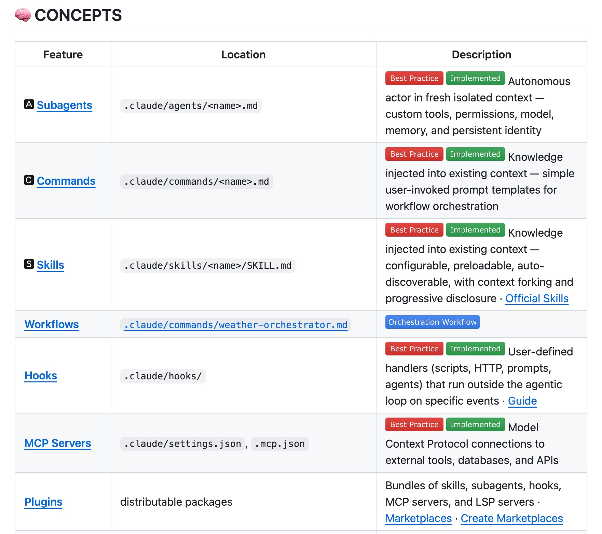

## 1. Claude 最佳实践：效率翻倍

[查看详情](https://github.com/shanraisshan/claude-code-best-practice)

告别冗余代码，这套保姆级指令集深入挖掘Claude潜能，使AI像资深架构师般高效编程。从工程设计到极速重构，一键即可提升代码质量，立即助你化身编程大神。

这是我边学、边用、边写的[Claude 最佳实践](/blog/agent/claude-code/claude-code-best-practice/)，希望对大家有帮助。

