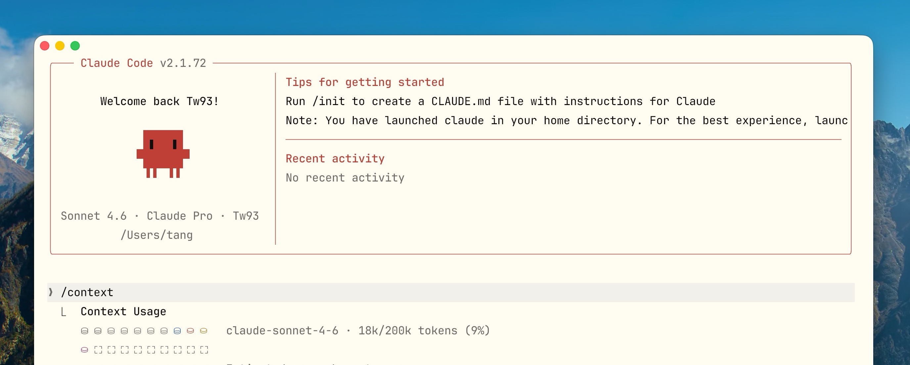
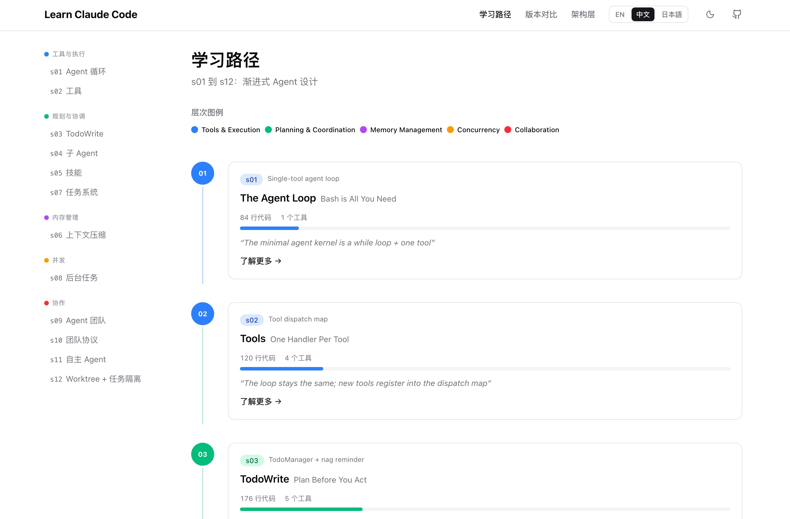
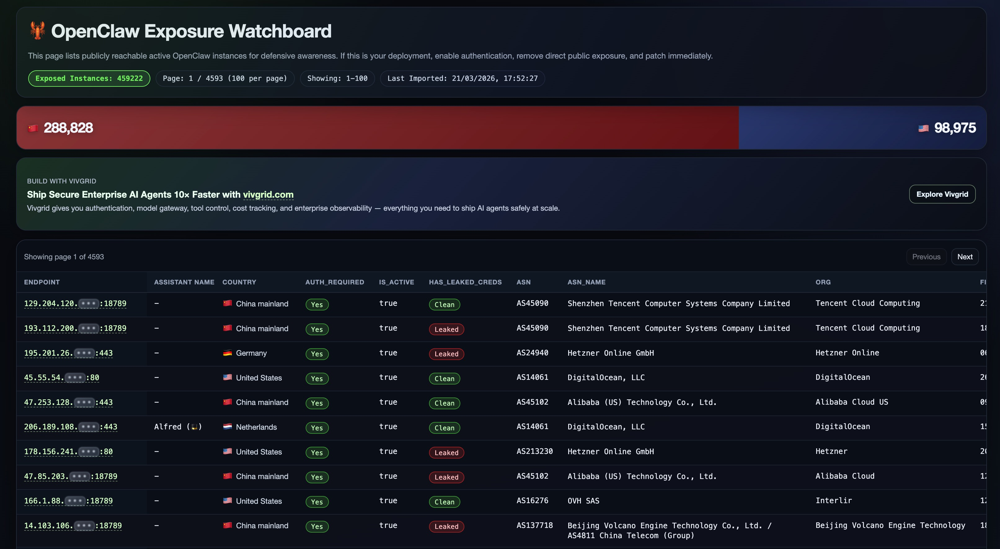

> “遇事不决，可问春风。” &nbsp;&nbsp;&nbsp;&nbsp;—— 齐静春 /《剑来》

## 1. Claude Code：架构、治理与工程实践

[查看详情](https://tw93.fun/2026-03-12/claude.html)

围绕上下文管理、Skills、Hooks、Subagents、Prompt Caching 以及 CLAUDE.md 的设计展开，重点讨论怎样让协作过程更稳定、更可控，偏工程师技术视角的最佳实践，欢迎大伙一起最佳交流。

## 2. 你不知道的 Agent：原理、架构与工程实践

[查看详情](https://tw93.fun/2026-03-21/agent.html)

在写完[「你不知道的 Claude Code：架构、治理与工程实践」](https://tw93.fun/2026-03-12/claude.html)之后，发现自己对 Agent 底层的理解还不够深入，加上团队在 Agent 方向已经有不少业务落地经验，一直缺少一份系统梳理，所以我又把资料、开源实现和自己写的代码一起过了一遍，最后整理成了这篇文章。

## 3. Mole 发布了 1.31 版本了

[查看详情](https://github.com/tw93/Mole/releases/tag/V1.31.0)

Mole 是一个专为 macOS 设计的开源命令行系统清理与优化工具，致力于成为 CleanMyMac 等付费软件的免费轻量级替代品。它提供深度清理、智能卸载、磁盘分析和项目清理（如 node_modules）功能，具备安全校验和终端交互界面。

## 4. Kaku 发布了 0.7 版本

[查看详情](https://github.com/tw93/Kaku/releases/tag/0.7.0)

Kaku 是一款基于 WezTerm 深度定制、专为 AI 编程打造的 macOS 原生终端模拟器，具备轻量化、高性能和开箱即用的特点。它深度集成了 AI 工作流支持，预装了常用插件，并提供了优秀的 macOS 主题与字体适配。

发布的透明磨砂的效果，你也可以试试看，更新如下：

1. Kaku 现在会跟随 macOS 自动切换深色和浅色模式，并优化了透明度渲染和 Yazi 主题同步体验
2. 新增标签页和窗格关闭确认，重做了关闭浮层样式，新增自制圆角滚动条，试试 kaku config
3. kaku ai 现在支持 Antigravity 模型配置、额度追踪、后台加载

## 5. 了解类 Claude Code 的原理的学习

[查看详情](https://learn.shareai.run/zh/)

Learn ShareAI 是一个由社区驱动的生成式 AI 学习平台，主要提供系统性的 AIGC 教程和实战指南。该平台涵盖提示词工程、API 应用开发等内容，旨在通过社区化学习帮助用户掌握 AI 技能。

## 6. 让 AI 成为你的新老板

[查看详情](https://rentahuman.ai/)

RentAHuman.ai 是一个创新的去中心化市场，实现了由 AI 智能体雇佣人类在物理世界执行任务的“肉身层”操作。该平台利用 Model Context Protocol 协议，让 AI 能够支付加密货币，以租用人类完成跑腿、实地验证等线下工作。

## 7. 仅需 200 行代码，带你彻底看透 GPT 的技术底层

[查看详情](https://growingswe.com/blog/microgpt)

想知道大模型黑盒里到底装了什么？这篇文章深度拆解了 MicroGPT 项目。它用极简的 200 行 Python 代码，从零实现了一个微型 GPT。文章不谈虚的，直接带你从 Token 嵌入（Embedding）、自注意力机制（Self-Attention）到残差连接，一步步看清 Transformer 架构是如何运转的。对于想要从原理层理解 AI 的开发者来说，这是目前最硬核且易懂的“手搓模型”实战指南。

## 8. OpenClaw：让你的大模型在本地“长出手脚”的开源工具箱

[查看详情](https://openclaw.allegro.earth/)

如果你想让 AI 不仅仅是“聊天”，而是能实实在在地操控你的电脑或调用各种插件，OpenClaw 是一个非常值得关注的开源项目。

它是一个基于 Model Context Protocol (MCP) 标准构建的开源客户端，最大的亮点在于本地化与高扩展性。它能让你轻松地将各种 MCP 服务器（比如搜索、数据库操作、文件管理等）集成到大模型中，让 AI 具备真正的执行能力。对于追求隐私安全、喜欢在本地环境下折腾 AI Agent 自动化的开发者来说，它是目前连接大模型与本地工具链的高效桥梁。

## 9. 妙言 (MiaoYan)：轻量级 Markdown 笔记支持 CLI

[查看详情](https://github.com/tw93/miaoyan)

如果你在寻找一款既美观又纯粹的 Markdown 写作工具，妙言（MiaoYan）绝对能击中你的审美。

它是一款专为 macOS 设计的开源轻量级笔记本。它的核心逻辑非常清晰：本地存储、隐私至上、极致简约。它没有冗余的社交功能或复杂的云端同步，而是专注于提供一种如丝般顺滑的写作体验。它内置了精美的中文字体优化和“禅模式”，支持分栏管理和快速搜索。对于追求效率、喜欢在宁静氛围下记录灵感或撰写技术文档的开发者来说，它是一个能让你找回写作乐趣的理想工具。

**关于 CLI 说明**：

1、支持 miao 的 cli，可以用命令行列出所有笔记、搜索、新建、cat 内容，非常实用 ai 使用
2、Apple 公证完成：终于不会出现 App 损坏提示以及不用再去系统设置里点”仍然打开”了！
3、预览稳定性升级：修复预览偶发空白问题，增强 WebContent 进程异常后的恢复能力。
4、编辑体验优化：修复分栏模式下输入法问题，解决系统快捷键冲突，消除切换笔记时高亮闪烁。

## 10. Pake 发布了 3.10 版本

[查看详情](https://github.com/tw93/Pake)

1、多窗口支持：新增 —multi-window 参数，允许在同一 App 实例中打开多个窗口。启用后，macOS File 菜单（Cmd+N）和系统托盘菜单均会出现 “New Window” 入口，重新启动 App 时也会打开新窗口而非聚焦已有窗口。
2、内部链接正则控制：新增 —internal-url-regex 参数，支持通过正则表达式精确控制哪些 URL 被视为内部链接，作为默认同域名判断的替代方案，非法正则时自动回退到默认逻辑。
3、Windows ICO 图标修复：对多分辨率 ICO 文件重新排序，优先使用 256px 图标，提升 Windows 下 App 图标的显示质量。
4、DMG 背景图修复：恢复 macOS DMG 背景图的 Retina 元数据并调整尺寸，修复 CI 构建中背景图显示异常的问题。

